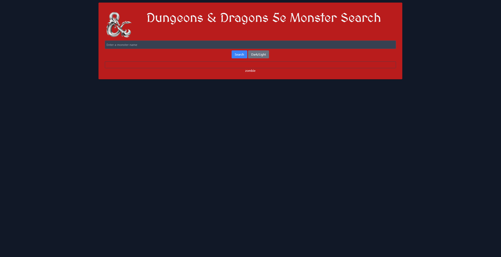

# React Portfolio – Simranjot Singh

This is a single-page portfolio built with **React** and **Vite**, showcasing my projects, skills, and contact information.

## 🚀 Live Site

👉 [View Portfolio on Netlify](https://shiny-alpaca-b095bb.netlify.app)

## 🧠 Tech Stack

- React (Vite)
- React Router DOM
- JavaScript (ES6+)
- HTML5 + CSS3
- Netlify (Deployment)

## 📁 Project Sections

- **About Me:** A short intro with my background and photo
- **Portfolio:** 6 real projects, each with a live link and GitHub repo
- **Contact:** A validated form for name, email, and message
- **Resume:** Downloadable PDF + list of proficiencies

## 📷 Screenshot

## 📄 Resume

Download my resume [here](./public/resume.pdf)

## 📬 Contact Me

If you’d like to work together or say hi, feel free to use the Contact form on the site!

---

## 🚀 Live Site

👉 [View Portfolio on Netlify](https://shiny-alpaca-b095bb.netlify.app)

## 📌 Author

**Simranjot Singh**  
React Developer | Student | Builder 💻
